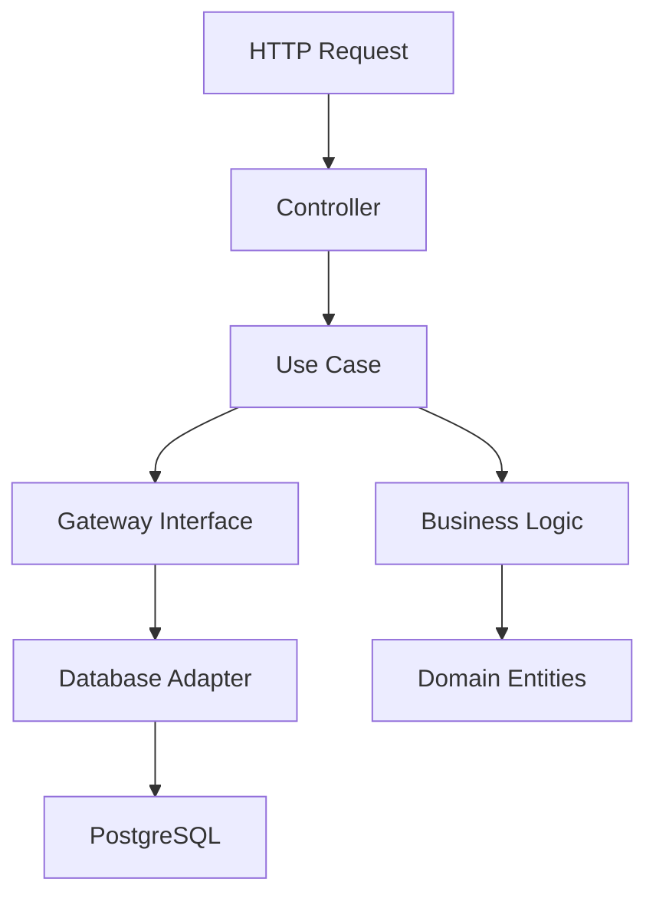

# 🍕 Rabi Food Core

**Rabi Food Core** is the main backend for the Rabi Food platform - a complete food delivery system built in Go with focus on **Clean Architecture**, **observability**, and **high performance**.

[](https://golang.org/)
[](LICENSE)
[](https://docker.com/)

---

## 🌟 Key Features

- **🏗️ Clean Architecture** - Clear separation of concerns and easy maintenance
- **🔍 Complete Observability** - Grafana, Prometheus, Loki, and Alloy integrated
- **🚀 REST API** - Well-documented endpoints using Fiber
- **🗄️ PostgreSQL** - Robust database with GORM
- **🧪 Integration Tests** - Complete coverage with integration tests
- **🐳 Docker Ready** - Fully containerized environment
- **📊 Multi-tenant** - Native support for multiple restaurants
- **🔐 JWT Authentication** - Secure authentication system
- **✅ Robust Validation** - Consistent data validation

---

## 🚀 Quick Start

### 📋 Prerequisites

- **[Go](https://go.dev/dl/)** v1.26.0+
- **[Docker](https://docs.docker.com/get-docker/)** & **[Docker Compose](https://docs.docker.com/compose/install/)**

### ⚙️ Install Dependencies

```bash
# Clone repository
git clone https://github.com/kelvinfloresta/rabi-food-core.git
cd rabi-food-core

# Install all required dependencies (Windows, Linux and macOS)
go run setup.go
```

This will install:
- **Task** - Task runner for automation
- **golangci-lint** - Go linter for code quality
- **gotestsum** - Enhanced test runner
- **mockery** - Mock generator
- All Go module dependencies

### ⚡ Run the Project

```bash
# Clone repository
git clone https://github.com/kelvinfloresta/rabi-food-core.git
cd rabi-food-core

# Install all dependencies (Windows, Linux and macOS)
go run setup.go

# Start development environment
task dev
```

The `task dev` command will:
- ✅ Start test infrastructure (PostgreSQL + pgAdmin)
- ✅ Run the Go application
- ✅ Load environment variables from `.env.test`

### 🌐 Available Access Points

| Service | URL | Description |
|---------|-----|-----------|
| **API** | `http://localhost:8080` | Main REST API |
| **pgAdmin** | `http://localhost:5050` | PostgreSQL web interface |
| **Grafana** | `http://localhost:3100` | Observability dashboard |

---

## 📁 Project Structure

```
rabi-food-core/
├── 📂 app/                     # Main application
│   ├── 🏗️ domain/             # Business entities and rules
│   ├── 💼 usecases/           # Use cases (application logic)
│   ├── 📚 libs/               # Libraries and adapters
│   │   ├── 🗄️ database/       # Gateways and data adapters
│   │   ├── 🌐 http/           # Controllers and HTTP routes
│   │   ├── 📋 logger/         # Logging system
│   │   ├── ✅ validator/      # Input validators
│   │   └── 🔧 di/             # Dependency injection
│   ├── ⚙️ config/             # Environment configurations
│   ├── 🧪 fixtures/           # Test data and mocks
│   └── 📄 app_context/        # Application context
├── 📂 infra/                   # Infrastructure and DevOps
│   ├── 🐳 docker-compose.*.yaml # Docker Compose files
│   ├── 📊 prometheus.yaml      # Prometheus configuration
│   ├── 📈 grafana/            # Dashboards and datasources
│   └── 🔍 loki-config.yaml   # Loki configuration
└── 📋 Taskfile.yml            # Task automation
```

---

## 🎯 Architecture and Design

### 🏗️ Clean Architecture

The project follows **Clean Architecture** principles, ensuring:

- **Clear separation of responsibilities**
- **Dependency inversion** through interfaces
- **High testability** and **maintainability**
- **Independence from external frameworks**

### 🔄 Data Flow



### 🏢 Main Domains

#### 👥 **Users**
- User profile management
- Authentication and authorization
- Different roles: `user` and `backoffice`

#### 🏪 **Tenants (Restaurants)**
- Multi-tenant system
- Restaurant management
- Data isolation per tenant

#### 📦 **Orders**
- Complete order lifecycle management
- Payment, delivery, and fulfillment status
- Real-time tracking

#### 🥘 **Products**
- Product catalog
- Categorization
- Price management

#### 🏷️ **Categories**
- Hierarchical product organization
- Filters and navigation

---

## 🧪 Testing and Quality

### 🚀 Running Tests

```bash
# Complete tests
task test

# Tests with observability
task test-with-logs

# Linting and code quality
task lint

# Generate mocks
task mockgen
```

### 📊 Coverage

- ✅ **Complete integration tests**
- ✅ **Automated mocks** with Mockery
- ✅ **Consistent data validation**
- ✅ **Linting** with golangci-lint

---

## 🛠️ Available Commands

| Command | Description |
|---------|-------------|
| `task dev` | Start development environment |
| `task test` | Run tests |
| `task test-with-logs` | Tests with complete observability |
| `task lint` | Static code analysis |
| `task build` | Production build |
| `task infra` | Start complete infrastructure |
| `task infra-down` | Stop infrastructure |
| `task mockgen` | Generate mocks |
| `task clean_docker` | Complete Docker cleanup |

---

## 🔍 Observability

### 📊 Monitoring Stack

- **🎯 Prometheus** - Metrics collection
- **📈 Grafana** - Visualization and dashboards  
- **📋 Loki** - Log aggregation
- **🔍 Alloy** - Telemetry collection and processing

### 🚀 Start Observability

```bash
# Complete infrastructure
task infra

# Validate Alloy configuration
task validate_alloy

# View application logs
task logs
```

---

## 🌐 API Endpoints

### 👥 Users
```
POST   /user/          # Create user
GET    /user/:id       # Get by ID  
PATCH  /user/:id       # Update user
DELETE /user/:id       # Delete user
GET    /user/paginate  # List with pagination
```

### 🏪 Tenants
```
POST   /tenant/        # Create tenant
GET    /tenant/:id     # Get by ID
PATCH  /tenant/:id     # Update tenant
```

### 📦 Orders
```
POST   /order/         # Create order
GET    /order/:id      # Get by ID
DELETE /order/:id      # Cancel order
POST   /order/:id/confirm-payment  # Confirm payment
GET    /order/paginate # List with pagination
```

### 🥘 Products
```
POST   /product/       # Create product
GET    /product/:id    # Get by ID
PATCH  /product/:id    # Update product
DELETE /product/:id    # Delete product
GET    /product/list   # List products
GET    /product/paginate # List with pagination
```

### 🏷️ Categories
```
POST   /category/      # Create category
GET    /category/:id   # Get by ID
PATCH  /category/:id   # Update category
DELETE /category/:id   # Delete category
GET    /category/paginate # List with pagination
```

---

## 🔧 Configuration

### 🌍 Environment Variables

The project uses the `.env.test` file (included in the repository) for development:

```env
# Database
DATABASE_HOST=localhost
DATABASE_PORT=5432
DATABASE_NAME=rabi_food
DATABASE_USER=postgres
DATABASE_PASSWORD=postgres

# Application
APP_PORT=8080
APP_ENV=development

# JWT
JWT_SECRET=your-secret-key
```

### 🐳 Docker Compose

Different environments available:

- `docker-compose.infra.yaml` - Complete infrastructure
- `docker-compose.infra-test.yaml` - Database only for tests
- `docker-compose.test.yaml` - Test environment with logs
- `docker-compose.yaml` - Production

---

## 🤝 Contributing

1. **Fork** the project
2. **Create** a branch for your feature (`git checkout -b feature/new-feature`)
3. **Commit** your changes (`git commit -am 'Add new feature'`)
4. **Push** to the branch (`git push origin feature/new-feature`)
5. **Open** a Pull Request

### 📝 Code Standards

- Follow **golangci-lint** standards
- Maintain high test coverage
- Document APIs and important functionality
- Use **Clean Architecture** in new modules

---

## 🏆 Technologies Used

| Category | Technology | Version |
|-----------|------------|--------|
| **Backend** | Go | 1.26.0 |
| **Web Framework** | Fiber | v2.50.0 |
| **Database** | PostgreSQL | - |
| **ORM** | GORM | v1.31.1 |
| **Authentication** | JWT | v5.0.0 |
| **Validation** | Validator | v10.28.0 |
| **Logging** | Zerolog | v1.31.0 |
| **DI** | Samber/do | v1.6.0 |
| **Testing** | Testify + HttpExpect | - |
| **Monitoring** | Prometheus + Grafana | - |
| **Logs** | Loki + Alloy | - |

---

## 📄 License

This project is under the **MIT** license. See the [LICENSE](LICENSE) file for more details.

---

## 🆘 Support

- 📧 **Email**: [your-email@example.com](mailto:your-email@example.com)
- 🐛 **Issues**: [GitHub Issues](https://github.com/kelvinfloresta/rabi-food-core/issues)
- 📖 **Documentation**: [Complete Documentation](link-to-docs)

---

<div align="center">

**Developed with ❤️ for the Go development community**

[⭐ Star on GitHub](https://github.com/kelvinfloresta/rabi-food-core) • [🐛 Report Bug](https://github.com/kelvinfloresta/rabi-food-core/issues) • [💡 Request Feature](https://github.com/kelvinfloresta/rabi-food-core/issues)

</div>